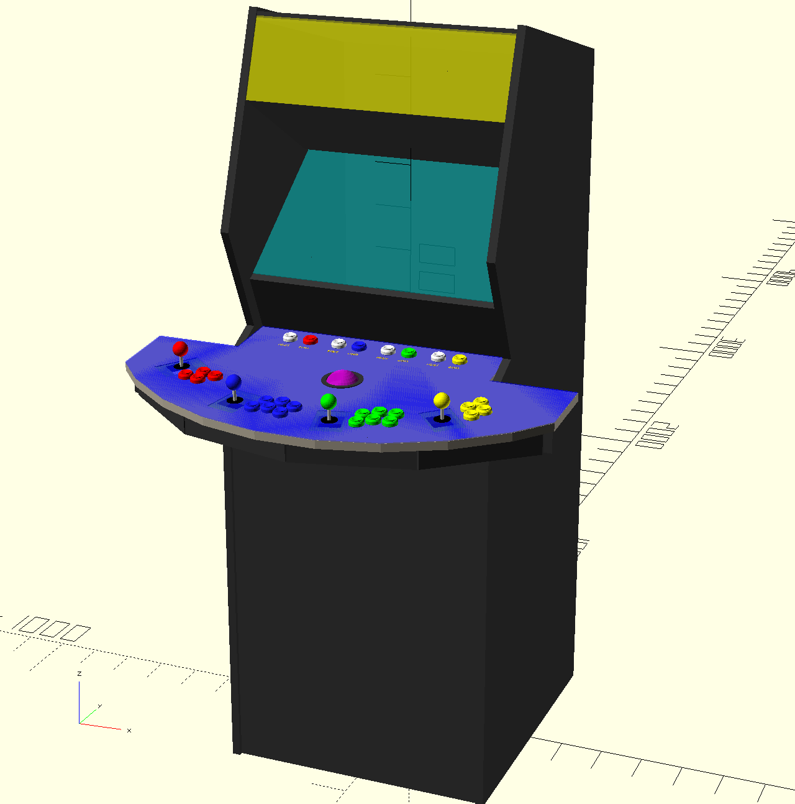

# OpenSCAD Arcade Modeling

This project contains models for designing and building arcade cabinets.

## Features

- Simple models for arcade controls: buttons, joysticks and trackballs
- Automatic generation of cutouts on control panel where controls are placed
- Support for two layer control panel construction. ie. an MDF panel with an
  acrylic top sheet.
- Configurable for multiple players
- Countersunk joystick mounting for completely flat panels

## Build instructions

Installing OpenSCAD and opening the .scad files in this project should be all you
need to do to view the models.
You can get the latest release of OpenSCAD on the OpenSCAD website:
http://www.openscad.com

## Using the output

The intent of this project is to output design files that can be either directly
laser cut on materials (ex. acrylic),
or used to create cutting guides for materials that cannot be laser cut (ex. MDF
or plywood).
The project currently creates correct models for how panels should be cut,
but does not yet output appropriate design files. Stay tuned...

## TODO

The following features still need to be implemented

- DXF output of control panel layout for laser cutting
- PDF output of control panel layout to be used as template for graphics design
- Automatic generation of box around control panel
- Flattened layout of cabinet panels to use as cutting guide
- Support for alternate button layouts. Currently only implements angled layout
- Support for side mounted pinball buttons
- Check joystick mount dimensions are correct for all joystick manufactures
- Model "spinner" controls
- Model coin slots/door
- Model control boards and mounts
- Model speakers

